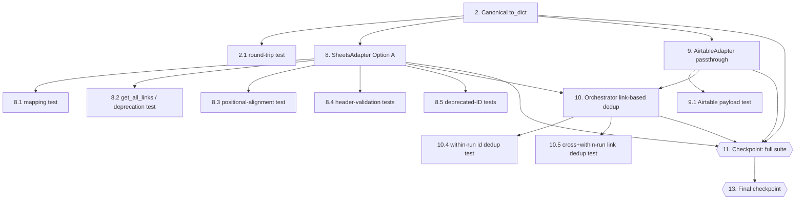

# Implementation Plan: Multi-Portal Adapter Architecture

## Overview

Refactor the GovRisk scraper from a single tightly-coupled Devex pipeline into a generic
multi-portal adapter architecture. Each portal is encapsulated as a self-contained adapter
implementing `BasePortalAdapter`. The orchestrator iterates over all active adapters uniformly.
Two new adapters are added (SAM.gov, Perplexity). `source_portal` is persisted in both stores.

## Tasks

- [x] 1. Extend Config with new portal fields and validation
  - Add `devex_enabled: bool = True`, `samgov_api_key: Optional[str] = None`,
    `samgov_enabled: bool = False`, `perplexity_api_key: Optional[str] = None`,
    `perplexity_enabled: bool = False` to the `Config` dataclass in `config.py`
  - Add `load_config()` reads for `DEVEX_ENABLED`, `SAM_GOV_API_KEY`, `SAM_GOV_ENABLED`,
    `PERPLEXITY_API_KEY`, `PERPLEXITY_ENABLED` using existing `_parse_bool_env` helpers
  - Add validation: raise `ValueError` when `samgov_enabled=True` and `samgov_api_key` is
    absent/empty; same for `perplexity_enabled` / `perplexity_api_key`
  - Update `.env.example` with `DEVEX_ENABLED`, `SAM_GOV_API_KEY`, `SAM_GOV_ENABLED`,
    `PERPLEXITY_API_KEY`, `PERPLEXITY_ENABLED` entries (with safe placeholder values)
  - _Requirements: 5.1, 5.2, 5.3, 5.4, 5.5, 5.6, 5.7, 5.8, 5.9_

  - [x] 1.1 Write property test for Config credential validation
    - **Property 8: Config credential validation raises on enabled-but-missing key**
    - **Validates: Requirements 5.6, 5.7**

- [x] 2. Add source_portal field and make to_dict() canonical & round-trippable (Option A)
  - Add `source_portal: str = "devex"` field to `OpportunityRecord` dataclass in `models.py`
  - Make `to_dict()` a canonical serializer that emits every model field under its INTERNAL name (including `source_portal`, `devex_opportunity_id`, `description_snippet`, `matched_keywords`, `relevance_reason`, `llm_confidence`, `llm_called`, `anna_benchmark`, `scraped_at`); it uses the internal `source_portal` key ONLY and never the external `portal_source` label
  - Ensure `from_dict(to_dict(record))` round-trips all fields; `from_dict()` reads `source_portal=str(data.get("source_portal", "devex"))`
  - _Requirements: 9.1, 9.2_

  - [x] 2.1 Write property test for canonical to_dict round-trip
    - **Property 2: Canonical to_dict round-trips every field (incl. arbitrary source_portal)**
    - **Validates: Requirements 6.6, 9.1, 9.2**

- [x] 3. Create BasePortalAdapter abstract base class
  - Create `portals/base_adapter.py` with `BasePortalAdapter(ABC)` class
  - Define `__init__(self, config: Config)` storing `self.config`
  - Define abstract property `portal_name -> str`
  - Define abstract async method `fetch_opportunities() -> list[dict]`
  - Add helper methods `_log_error`, `_log_http_error`, `_log_parse_error`,
    `_log_auth_error` that delegate to `AuditLogger` and `Notifier` (accept both as
    constructor args alongside `config`, or instantiate internally)
  - _Requirements: 1.1, 1.2, 1.3, 1.4, 1.5_

  - [x] 3.1 Write unit test for BasePortalAdapter ABC enforcement
    - Verify that instantiating a subclass missing `portal_name` or `fetch_opportunities`
      raises `TypeError`
    - _Requirements: 1.3_

- [x] 4. Implement DevexAdapter
  - Create `portals/devex_adapter.py` with `DevexAdapter(BasePortalAdapter)`
  - Set `portal_name = "devex"`
  - Implement `fetch_opportunities()`: instantiate `DevexAuth`, call `load_session()`,
    create `DevexSearch` and `DevexParser`, collect URLs, parse each URL in a try/except,
    remap `devex_opportunity_id` → `opportunity_id`, set `source_portal = "devex"`
  - Catch `AuthenticationError`: log via `AuditLogger`, alert via `Notifier`, return `[]`
  - Close all Playwright resources in `finally` block unconditionally
  - _Requirements: 2.1, 2.2, 2.3, 2.4, 2.5, 2.6, 7.1, 7.2_

  - [x] 4.1 Write unit tests for DevexAdapter error paths
    - Test `AuthenticationError` path: assert `[]` returned, audit + notifier called
    - Test per-URL parse failure: assert partial results returned, loop continues
    - Test Playwright `finally` close: assert `auth.close()` called even when exception raised
    - _Requirements: 2.3, 2.4, 2.5_

  - [x] 4.2 Write property test for Devex opportunity_id format
    - **Property 11: Devex opportunity_id matches portal-prefixed format**
    - **Validates: Requirements 10.1**

- [x] 5. Implement SAMGovAdapter with LATAM post-filter
  - Create `portals/samgov_adapter.py` with `SAMGovAdapter(BasePortalAdapter)`
  - Set `portal_name = "samgov"` and `BASE_URL = "https://api.sam.gov/opportunities/v2/search"`
  - Implement `fetch_opportunities()`: guard on `samgov_enabled`, build params dict with
    `api_key`, `q` (space-joined `sector_keywords`), `limit`, `postedFrom` (30 days ago),
    make async `httpx` GET, raise on HTTP error, post-filter with `_is_latam_relevant()`,
    map results with `_map_result()`
  - Implement `_is_latam_relevant(item)`: check `placeOfPerformance.country.name`,
    `placeOfPerformance.state.name`, and `description` against `Config.target_countries`
    (case-insensitive substring match); return `True` if any match, `True` if no target
    countries configured
  - Implement `_map_result(item)`: map `noticeId`, `title`, `organizationName`,
    `responseDeadLine`, `placeOfPerformance`, `award.amount`, `description` to
    `Opportunity_Dict`; set `opportunity_id = f"samgov-{noticeId}"`,
    `source_portal = "samgov"`
  - _Requirements: 3.1, 3.2, 3.3, 3.4, 3.5, 3.6, 3.7, 7.1_

  - [x] 5.1 Write unit tests for SAMGovAdapter guard and HTTP error paths
    - Test `samgov_enabled=False` returns `[]` without making HTTP calls
    - Test HTTP 4xx/5xx: assert `[]` returned, error logged
    - _Requirements: 3.5, 3.6_

  - [x] 5.2 Write property test for SAMGovAdapter query params
    - **Property 9: SAM.gov query params reflect Config values**
    - **Validates: Requirements 3.3**

  - [x] 5.3 Write property test for SAM.gov opportunity_id format
    - **Property 12: SAM.gov opportunity_id matches portal-prefixed format**
    - **Validates: Requirements 10.2**

  - [x] 5.4 Write property test for LATAM post-filter
    - **Property 16: SAMGovAdapter LATAM post-filter excludes non-target countries**
    - **Validates: Requirements 3.4, 3.3**

- [x] 6. Implement PerplexityAdapter
  - Create `portals/perplexity_adapter.py` with `PerplexityAdapter(BasePortalAdapter)`
  - Set `portal_name = "perplexity"` and `PERPLEXITY_API_URL`
  - Implement `fetch_opportunities()`: guard on `perplexity_enabled`, build prompt via
    `_build_prompt()`, POST to Perplexity API with `sonar-pro` model, handle HTTP errors,
    parse response via `_parse_response()`
  - Implement `_build_prompt()`: embed `sector_keywords`, `target_countries`, `max_results`;
    request JSON array with exact keys matching `Opportunity_Dict` contract
  - Implement `_parse_response()`: strip markdown fences, `json.loads`, map each item to
    `Opportunity_Dict` with `opportunity_id = f"perplexity-{_deterministic_hash(link)}"`,
    `source_portal = "perplexity"`; catch all exceptions, log, return `[]`
  - Implement `_deterministic_hash(link)`: `hashlib.sha256(link.encode()).hexdigest()[:12]`
  - _Requirements: 4.1, 4.2, 4.3, 4.4, 4.5, 4.6, 4.7, 4.8, 7.1_

  - [x] 6.1 Write unit tests for PerplexityAdapter guard and error paths
    - Test `perplexity_enabled=False` returns `[]` without HTTP calls
    - Test HTTP error returns `[]` with error logged
    - Test unparseable JSON response returns `[]` with parse failure logged
    - _Requirements: 4.5, 4.6, 4.7_

  - [x] 6.2 Write property test for Perplexity prompt content
    - **Property 10: Perplexity prompt contains all configured keywords and countries**
    - **Validates: Requirements 4.3**

  - [x] 6.3 Write property test for Perplexity opportunity_id determinism
    - **Property 13: Perplexity opportunity_id is deterministic**
    - **Validates: Requirements 10.3**

- [x] 7. Checkpoint — Ensure all adapter unit and property tests pass (satisfied: all adapter unit and property tests pass; 62/62 green property tests are intentionally absent and a pre-existing main baseline test fails)
  - Ensure all tests pass, ask the user if questions arise.

- [x] 8. Update SheetsAdapter for the frozen 12-column Live_Sheet_Schema, startup header validation, and ID-method deprecation (Option A)
  - Preserve the exact frozen 12-column `HEADERS` (Live_Sheet_Schema) unchanged — do NOT append `source_portal`
  - Rewrite `write_record()` to explicitly project the canonical `to_dict()` payload onto the 12 external columns via `CANONICAL_KEY_FOR_COLUMN`, mapping canonical `source_portal` onto the external `portal_source` column (column 1); join `risk_flags` to a comma string; `None` -> ""
  - Add strict startup header validation (`_ensure_headers()`/`_validate_headers()`): initialize an empty sheet with the canonical header, else reject missing / duplicate (incl. whitespace/case) / reordered / unexpected headers via `SheetsSchemaError`; never auto-repair a populated header
  - Add `get_all_links()` (reads the `opportunity_link` column, col 7) for cross-run deduplication
  - Make `get_all_ids()`, `record_exists()`, and `get_records_since()` unsupported for Sheets (raise `NotImplementedError`): the frozen schema has no persisted opportunity-ID column and no `scraped_at` column
  - _Requirements: 9.3, 9.4, 9.6, 9.8, 9.9, 6.8, 10.5_

  - [x] 8.1 Write property test: source_portal maps to the portal_source column (frozen 12-column schema)
    - **Property 14: SheetsAdapter maps source_portal onto the portal_source column (col 1)**
    - **Validates: Requirements 9.3, 9.4**

  - [x] 8.2 Write property tests: get_all_links() link-based cross-run dedup; Sheets get_records_since() unsupported (raises); Airtable get_records_since() supplies the legacy "devex" default (distinct from the unsupported Sheets method)
    - **Property 15: get_all_links seeds link-based cross-run dedup; Sheets get_records_since is deprecated; Airtable defaults legacy source_portal to "devex"**
    - **Validates: Requirements 6.8, 9.6, 9.7, 10.5**

  - [x] 8.3 Write positional-alignment compatibility test
    - Assert the written row width == len(HEADERS) == 12 and every value lands under its intended header (source_portal under portal_source at col 1, opportunity_link at col 7)
    - _Requirements: 9.3, 9.4_

  - [x] 8.4 Write adversarial startup header-validation tests
    - Cover: exact valid header; empty-sheet initialization; missing required header; duplicate exact header; duplicate after trim/case normalization; reordered header; unexpected extra header; validation occurs before any write
    - _Requirements: 9.8_

  - [x] 8.5 Write deprecation tests for get_all_ids()/record_exists()
    - Assert both raise NotImplementedError before any worksheet call, directing callers to get_all_links()
    - _Requirements: 9.9_

- [x] 9. Update AirtableAdapter to pass canonical to_dict() through (Option A)
  - `write_record()` forwards the canonical `to_dict()` payload to Airtable (with documented `None` -> "" normalization), so `source_portal` and `devex_opportunity_id` flow through under their internal key names
  - Add `get_all_links()` parity (reads persisted `opportunity_link`) so cross-run dedup seeding works for the Airtable backend too
  - `get_records_since()` supplies the legacy read default `fields.setdefault("source_portal", "devex")` for records predating the field (this remains supported for Airtable, unlike Sheets)
  - Operational prerequisite (note, not code): the Airtable table schema MUST contain fields matching the canonical keys (in particular `source_portal` and `devex_opportunity_id`) or Airtable rejects writes to unknown field names
  - _Requirements: 9.5, 9.6, 9.7_

  - [x] 9.1 Write Airtable write_record payload test
    - Inspect the argument passed to table.create(): complete canonical payload with documented None-normalization; includes source_portal and devex_opportunity_id; excludes external label portal_source; returns created id; updates in-memory id cache; sleep mocked
    - _Requirements: 9.5_

- [x] 10. Refactor main.py orchestrator with adapter registry, isolated exception handling, and link-based cross-run dedup (Option A)
  - Replace all existing imports from `auth/`, `scraper/` with imports from `portals/`
  - Import `BasePortalAdapter`, `DevexAdapter`, `SAMGovAdapter`, `PerplexityAdapter`
  - Build adapter registry: append each adapter only when its `enabled` flag is `True`
  - Implement unified adapter loop: each `adapter.fetch_opportunities()` call wrapped in its
    own `try/except Exception` block; on exception: increment `errors`, call
    `audit.log_error()`, call `notifier.send_error_alert(component=adapter.portal_name)`,
    then `continue` — never `return` or `raise`
  - Collect all results into `all_opportunities: list[dict]`
  - Seed cross-run deduplication from `store.get_all_links()` (NOT `get_all_ids()`), with cross-run identity keyed on `opportunity_link`; within a run, additionally skip a repeated non-empty `opportunity_id` and a repeated non-empty `opportunity_link`
  - Thread `source_portal` through `Opportunity_Dict` → `OpportunityRecord.from_dict()` →
    store write; include `source_portal` in `audit.log()` detail for each processed record
  - Preserve existing filter → LLM → store pipeline logic unchanged
  - _Requirements: 6.1, 6.2, 6.3, 6.4, 6.5, 6.6, 6.7, 6.8, 7.1, 7.2, 7.3, 7.4, 10.4, 10.5_

  - [x] 10.1 Write property test for adapter registry composition
    - **Property 5: Adapter registry contains exactly the enabled adapters**
    - **Validates: Requirements 6.1**

  - [x] 10.2 Write property test for unified list union
    - **Property 6: Unified list is the union of all adapter results**
    - **Validates: Requirements 6.2**

  - [x] 10.3 Write property test for failing adapter isolation
    - **Property 7: Failing adapters do not suppress results from healthy adapters**
    - **Validates: Requirements 6.4**

  - [x] 10.4 Write property test for within-run deduplication by opportunity_id
    - **Property 3: Deduplication eliminates repeated opportunity_id values**
    - **Validates: Requirements 6.7, 10.4**

  - [x] 10.5 Write property test for cross-run + within-run deduplication by opportunity_link
    - **Property 4: Deduplication eliminates repeated opportunity_link values**
    - **Validates: Requirements 6.7, 6.8, 10.5**

- [ ] 11. Checkpoint — Ensure all tests pass (not satisfied on this branch: pre-existing main baseline failures remain — see baseline proof)
  - Ensure all tests pass, ask the user if questions arise.

- [x] 12. Write property test for adapter result field completeness
  - Add `test_adapter_result_fields_complete` to the test suite
  - Mock HTTP responses for `SAMGovAdapter` and `PerplexityAdapter`; mock Playwright for
    `DevexAdapter`; assert every returned dict contains all required `Opportunity_Dict` keys
  - **Property 1: Adapter result fields are complete**
  - **Validates: Requirements 3.4, 4.4**

- [ ] 13. Final checkpoint — Ensure all tests pass and imports resolve (imports resolve; full suite still has pre-existing main baseline failures)
  - Run `python -c "import main"` to verify no `ModuleNotFoundError` or `ImportError`
  - Ensure all tests pass, ask the user if questions arise.

## Notes

- Tasks marked with `*` are optional and can be skipped for faster MVP
- Each task references specific requirements for traceability
- Checkpoints ensure incremental validation
- Property tests use Hypothesis; tag format: `# Feature: multi-portal-adapter-architecture, Property N: <text>`
- The per-adapter `try/except Exception` in the orchestrator loop is a hard requirement — see design Error Handling section
- `_is_latam_relevant()` in `SAMGovAdapter` is required because SAM.gov returns global results

## Schema v1.1 — Discovery Metadata Extension

- [x] 14. Extend Live_Sheet_Schema from 12 to 14 columns (append `scraped_at`, `matched_keywords`)
  - Header-name-driven writer binds values by normalized column name, not position
  - Accept any column order; reject missing required or duplicate columns
  - Unknown additional columns written as blank
  - Populated header rows never automatically rewritten
  - `scraped_at` = UTC discovery timestamp, ISO 8601 with Z suffix; naive datetimes rejected
  - `matched_keywords` = authoritative UTF-8 JSON array; Tool 2 displays without recomputation
  - Empty matches serialize as `[]`; historical blank values valid
  - Legacy 12-column header produces explicit migration error
  - _Code and tests: complete on `feature/sheet-schema-v1.1` (116 tests pass, 3 known stubs)_
  - _Live Google Sheet migration: **pending — not authorized**_

## Requirement 11 — Additional requirement traceability (documented, not directly verified)

The following Requirement 11 clauses are implemented and documented in `design.md`
but do NOT have a dedicated verifying test (do not treat them as verified):

- [ ] Req 11.15 Exponential backoff `0.5 * 2^(attempt-1)` + jitter, clamped to the remaining deadline
  - GAP: retry/backoff behavior is exercised (`test_transient_failure_then_success`, `test_repeated_transient_failures_exhaust_attempts`, `test_retry_after_numeric_respected`), but the exact exponential formula, jitter, and deadline-clamp calculation are not directly asserted.
- [ ] Req 11.18 Enrichment_Deadline (120s) applies only to the Enrichment_Phase, excluding the listing-page fetch
  - GAP: documented in `design.md`; no dedicated test proves the listing fetch is outside the enrichment deadline.
- [ ] Req 11.19 Per-attempt detail-fetch request timeout of 12 seconds on the shared client
  - GAP: shared-client construction/reuse is tested (`test_shared_client_reused`), but no test inspects the configured 12-second per-request timeout.

## Requirement 11 (UNDP Description Enrichment) — Traceability

UNDP-enrichment invariants and their verifying tests in
`tests/test_undp_detail_fetch.py` (example-based; no Hypothesis/`@given`).
`[x]` = fully verified on this branch; `[ ]` = partially verified or unverified
(gap noted). No nonexistent tests are claimed.

- [ ] 11-inv-17 Matching text authoritative/consistent across `passes_filter()` and `get_matched_keywords()` (Req 11.2)
  - PARTIAL: `test_keyword_after_1000_chars_passes_filter_and_matched_keywords`, `test_non_undp_opportunity_filters_normally`; no test asserts both methods derive identical text from `get_matching_text()` for the same dict.
- [ ] 11-inv-18 `_matching_text` precedence, `description_snippet` fallback (Req 11.3, 11.4)
  - PARTIAL: fallback via `test_non_undp_opportunity_filters_normally`; precedence via `test_keyword_after_1000_chars_passes_filter_and_matched_keywords`; no dedicated `get_matching_text()` unit test asserts the exact rule.
- [ ] 11-inv-19 Full `_matching_text` + bounded `description_snippet` (Req 11.5, 11.6)
  - PARTIAL: `test_extract_overview_full_text_not_truncated` (full text), `test_keyword_after_1000_chars_passes_filter_and_matched_keywords` (snippet <= 1000, `_matching_text` present); exact `description_snippet == overview[:1000]` not asserted.
- [x] 11-inv-20 Transient fields never reach the store (Req 11.7, 11.8)
  - FULL: `test_matching_text_excluded_before_serialization`, `test_orchestration_end_to_end_keyword_after_1000`.
- [x] 11-inv-21 Detail-fetch concurrency <= 8 (Req 11.9, 11.10, 11.11)
  - FULL: `test_concurrency_bounded_and_expired_skipped` (`1 < peak <= _MAX_CONCURRENT_DETAIL_FETCHES`). Note: semaphore-release-during-backoff is separately covered by `test_semaphore_released_during_backoff`.
- [x] 11-inv-22 Retryable vs permanent classification + bounded attempts (Req 11.12, 11.13, 11.14)
  - FULL: `test_transient_failure_then_success`, `test_repeated_transient_failures_exhaust_attempts`, `test_404_gets_exactly_one_attempt`.
- [x] 11-inv-23 Retry-After parsing (delay-seconds/HTTP-date/invalid) with clamp (Req 11.16, 11.17)
  - FULL: `test_parse_retry_after_delay_seconds`, `test_parse_retry_after_http_date`, `test_parse_retry_after_invalid_returns_zero`, `test_retry_after_numeric_respected`.
- [ ] 11-inv-24 Partial results preserved on deadline (Req 11.20, 11.21, 11.22, 11.23)
  - PARTIAL: `test_timeout_preserves_completed_records` verifies preservation, cancellation-awaited (no pending), and exact warning counts (total=6, completed=5, fallback=0, cancelled=1); it does not directly assert the cancelled opportunity keeps a title-based `description_snippet` and is still passed to `KeywordFilter`.
- [ ] 11-inv-25 Write exactly once (live) / no write (dry-run) (Req 11.24, 11.25)
  - PARTIAL: `test_orchestration_end_to_end_keyword_after_1000` verifies exactly one live-mode `Store.write_record`; the dry-run no-write case is unverified.
- [x] 11-inv-26 Deep-keyword end-to-end with clean storage, live mode (Req 11.5, 11.6, 11.25)
  - FULL (live mode): `test_orchestration_end_to_end_keyword_after_1000`.

Unverified/partial invariants above are follow-up test gaps, not regressions: 17, 18, 19; invariant 24's remaining gap is that a cancelled/failed opportunity retains its title-based `description_snippet` and is still passed through the `KeywordFilter` (not directly asserted); invariant 25's remaining gap is the dry-run no-write case. (The dry-run gap belongs only to invariant 25; invariant 24 has no dry-run component.)

## Task Dependency Graph

Option A schema-contract work builds on the multi-portal baseline already on `main`.
Leaf implementation/test tasks below are complete on this branch; checkpoints remain
open until the full suite is green (pre-existing baseline failures are tracked separately).

